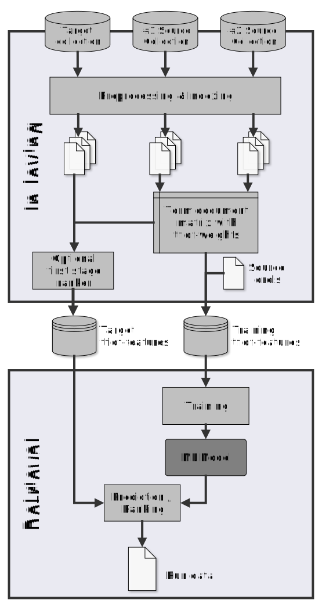

# Annotated dataset

We have curated a dataset of annotated run files resulting from different experiments that share the same retrieval method on a more abstract level. All of these runs are based on *cross-collection relevance feedback* for which relevance labels and the corresponding documents from one or more *source collections* are used as training data to train a relevance classifier that ranks documents of a *target collection*. While some of the runs were available from the TREC run archive, others were reimplemented by us. All of the runs are annotated in accordance with the outlined metadata schema. The dataset is hosted in an external [Zenodo archive](). Some of the runs are used for the demonstration on Colab.

The run dataset is compiled from the following reproduced experiments:

- Grossman and Cormack @ TREC Common Core 2017 [Paper](https://trec.nist.gov/pubs/trec26/papers/MRG_UWaterloo-CC.pdf) | [Runs](https://trec.nist.gov/) 

- Grossman and Cormack @ TREC Common Core 2018 [Paper](https://trec.nist.gov/pubs/trec27/papers/MRG_UWaterloo-CC.pdf) | [Runs](https://trec.nist.gov/) 

- Yu et al. @ TREC Common Core 2018 [Paper](https://trec.nist.gov/pubs/trec27/papers/h2oloo-CC.pdf) | [Runs](https://github.com/castorini/Anserini/blob/master/docs/runbook-trec2018-h2oloo.md)

- Yu et al. @ ECIR 2019 [Paper](https://link.springer.com/chapter/10.1007/978-3-030-15712-8_26) | [Runs](https://github.com/castorini/anserini/blob/master/docs/runbook-ecir2019-ccrf.md)

- Breuer et al. @ SIGIR 2020 [Paper](https://dl.acm.org/doi/10.1145/3397271.3401036) | [Runs](https://zenodo.org/record/3856042) 

- Breuer et al. @ CLEF 2021 [Paper](https://link.springer.com/chapter/10.1007/978-3-030-85251-1_5) | [Runs](https://zenodo.org/record/4105885)

The figure below illustrates the principle idea behind cross-collection relevance feedback.

  

